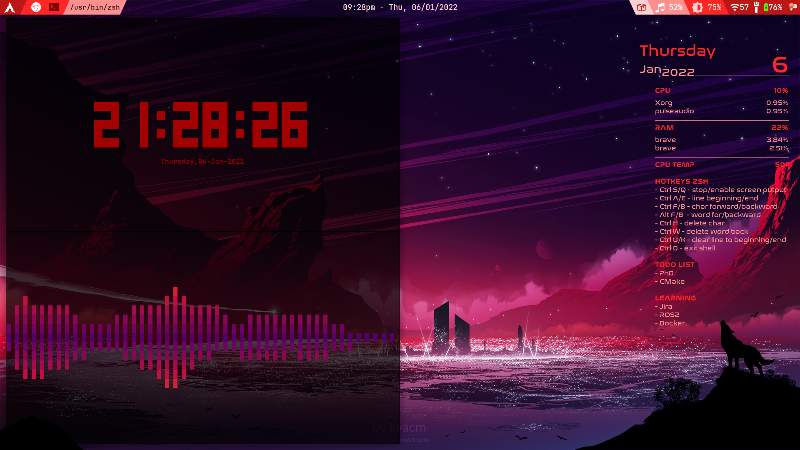
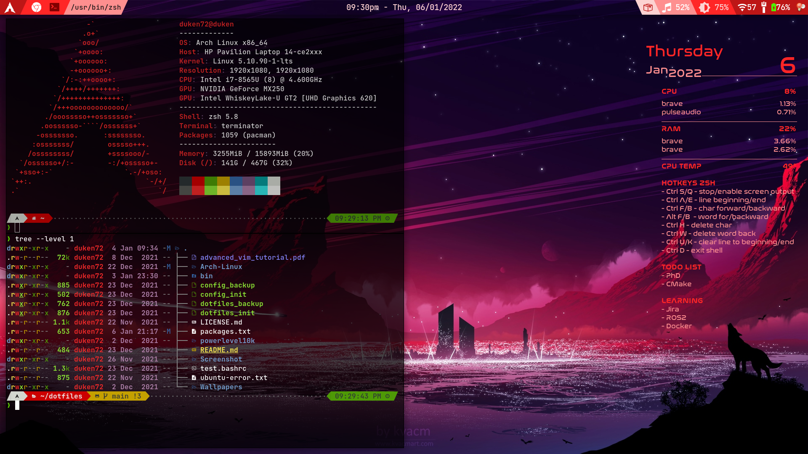

<!-- omit in toc -->
# dotfiles

[](https://github.com/duken72/dotfiles)

My personal dotfiles and configs.

<!-- omit in toc -->
## Table of Contents

- [Screenshots](#screenshots)
- [Packages](#packages)
  - [Install packages and dependencies](#install-packages-and-dependencies)
- [dotfiles and configs](#dotfiles-and-configs)
  - [Backup existing dotfiles and configs](#backup-existing-dotfiles-and-configs)
  - [Install dotfiles and configs](#install-dotfiles-and-configs)
- [License](#license)

-------

## Screenshots

For backgrounds, check folder [Wallpapers](Wallpapers).





-------

## Packages

Packages that I currently use at [arch_packages.txt](Arch-Linux/arch_packages.txt).

Some names that are worth mentioned:

- Shell: zsh with zsh-autosuggestions, zsh-completions, powerlevel10k
- Panel: polybar
- App launcher: rofi
- Desktop system monitor: conky
- Browser: brave
- exa (replacement for ls), also ranger
- Media player: moc, mpd, mpv
- For fun: cli-visualizer (audio visualizer), tty-clock-git, neofetch, lightdm-webkit-theme-osmos, etc.
- fd, fzf (replacement for find)
- bat (replacement for less and cat)
- sd (replacement for sed)
- ripgrep (replacement for grep)
- redshift

### Install packages and dependencies

Ubuntu:

```bash
xargs -a packages.txt -E END sudo apt-get install # for Ubuntu
```

Arch Linux:

```bash
??
```

-------

## dotfiles and configs

### Backup existing dotfiles and configs

I'm, actually .. kind of .. proud of my `.aliases`. Though not much, but I have gone quite a long way, from ground zero.

Backup if needed:

```bash
chmod +x *_backup
./dotfiles_backup
./config_backup
```

### Install dotfiles and configs

Sync all, or choose what you want.

``` bash
chmod +x *_install
./dotfiles_install
./config_install
```

Uninstall with:

```bash
chmod +x dotfiles_uninstall
./dotfiles_uninstall
```

-------

## License

See the [LICENSE](LICENSE.md) file for license rights and limitations (MIT).
