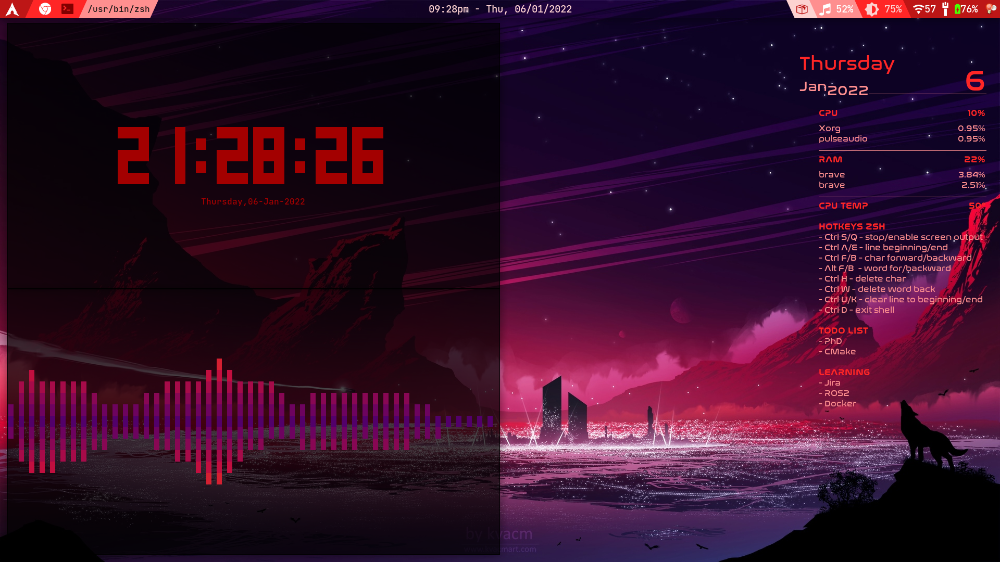

# `dotfiles`

My personal `dotfiles` and `configs`.

## Table of contents

<!-- vim-markdown-toc GFM -->

* [Screenshots](#screenshots)
* [Packages](#packages)
  * [Install packages and dependencies](#install-packages-and-dependencies)
* [`dotfiles` and `configs`](#dotfiles-and-configs)
  * [Backup existing `dotfiles` and `configs`](#backup-existing-dotfiles-and-configs)
  * [Install `dotfiles` and `configs`](#install-dotfiles-and-configs)
* [License](#license)

<!-- vim-markdown-toc -->

---

## Screenshots

For backgrounds, check [Wallpapers](Wallpapers).




---

## Packages

Packages that I currently use at [pkg_pacman.txt](pkg_pacman.txt) and [pkg_aura.txt](pkg_aura.txt)

Some worth-mentioned names:

- Shell: `zsh` with `zsh-autosuggestions`, `zsh-completions`, `powerlevel10k`
- Panel: `polybar`
- App launcher: `rofi`
- Desktop system monitoring: `conky`
- Browser: `brave`
- `eza`, as replacement for `ls`, also `ranger`
- Media player: `moc`, `mpd`, `mpv`
- `fd`, `fzf` replace `find`
- `bat`, replace `less` and `cat`
- `sd`, replace `sed`
- `ripgrep`, replace `grep`
- `redshift`
- Others: `cli-visualizer` for audio visualizer, `tty-clock-git`, `neofetch`, `lightdm-webkit-theme-osmos`, etc.

### Install packages and dependencies

Ubuntu:

```bash
xargs -a packages.txt -E END sudo apt-get install # for Ubuntu
```

Arch Linux:

```bash
pacman -S --needed - < pkg_pacman.txt
aura -A - < pkg_aura.txt
```

---

## `dotfiles` and `configs`

```bash
chmod +x *.sh
```

### Backup existing `dotfiles` and `configs`

I'm, actually .. kind of .. proud of my `.aliases`. Though not much, but I have gone quite a long way, from ground zero.

Backup if needed:

```bash
./dfs.sh -b
./cfg.sh -b
./pkg_backup
```

### Install `dotfiles` and `configs`

Sync all, or choose what you want.

```bash
./dfs.sh -i
./cfg.sh -i
```

Uninstall with:

```bash
./dfs.sh -u
./cfg.sh -u
```

---

## License

See the [MIT LICENSE](LICENSE.md) file for license rights and limitations.
